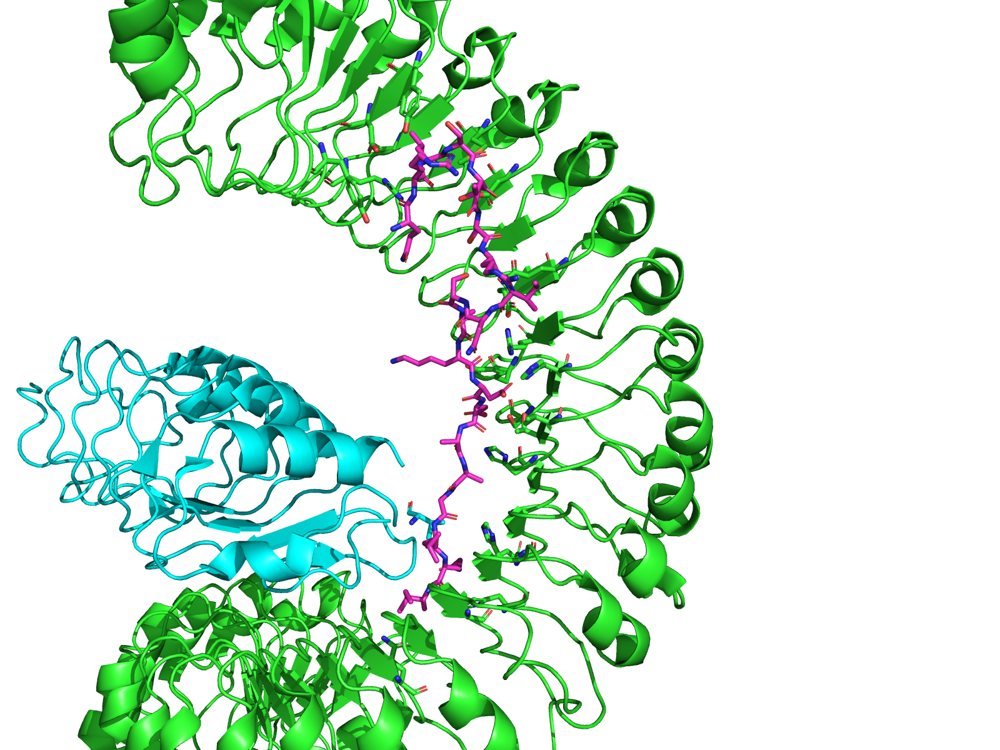
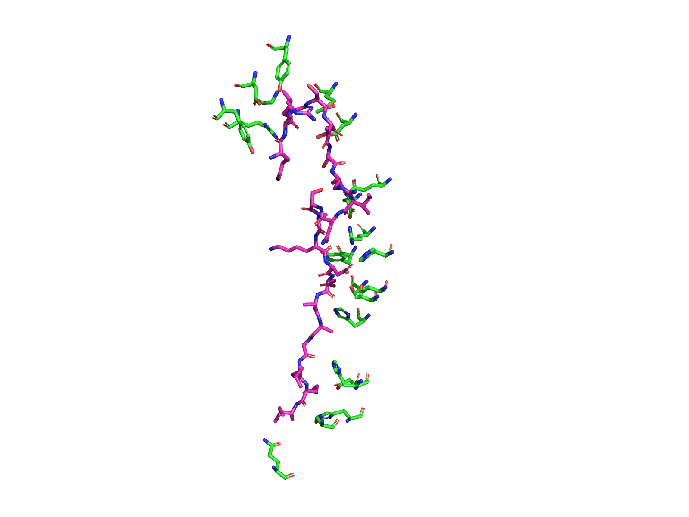
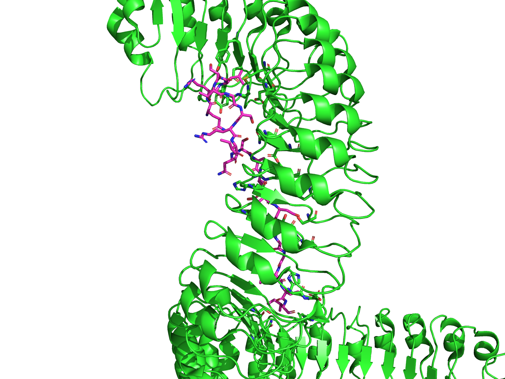
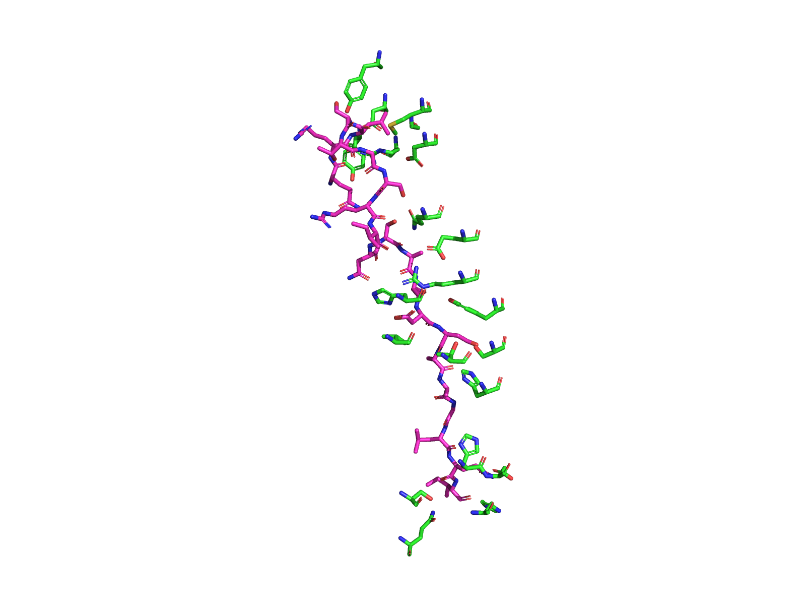
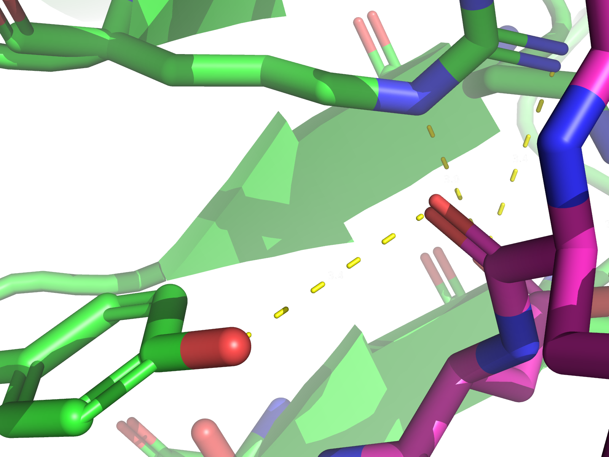
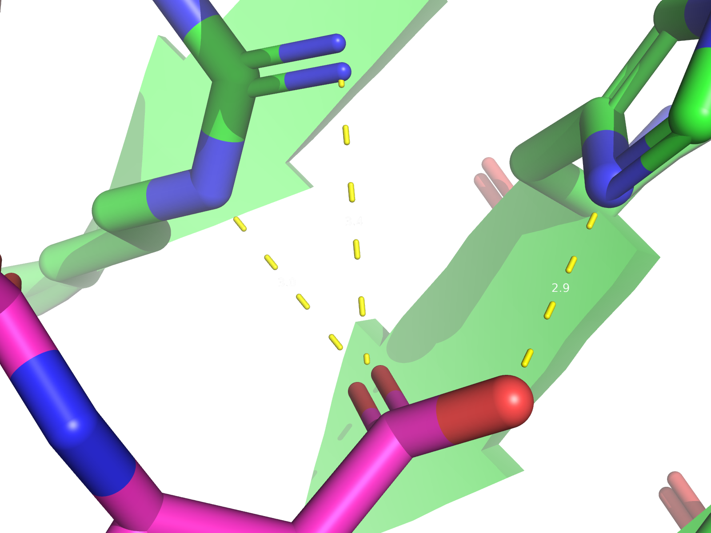

# First week of class
This weeks assignment involved learning to use PyMOL. I chose to use

## Renders

## Written component
I chose FLS2 bound to flg22 (PDB: 4MN8) because I like plants and was curious what this receptor looked like. I also find it interesting how plants manage to receive signals from the environment and respond to them, and receptors like these are important lines in those signaling pathways.
I immediately noticed two things: The receptor has a helical shape to it, the flg22 protein fits into the groove of the receptor, and the cofactor protein looks like it aligns flg22 or holds it in place. The types of interactions that cause these proteins to interact are important to understand because they and other interactions like them are the building blocks of the binding behaviors of all proteins.
These interactions are also important to understand because understanding them puts us in a better position to determine the effects of making changes. It’s possible that if we changed the amino acid sequence in the cofactor protein, flg22 might not align properly with FLS2 rendering it less effective or broken. On the other hand, changing the sequences might make the interactions more favorable, or increase the number of places where the interactions can occur, making the receptor significantly more functional, increasing the plant’s defensive abilities.
